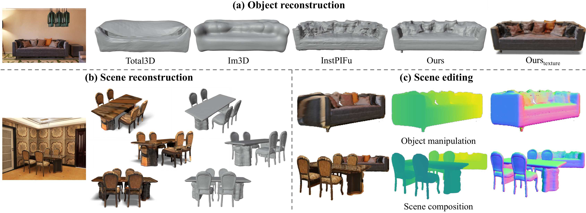

# Single-view 3D Scene Reconstruction with High-fidelity Shape and Texture (3DV 2024)

<p align="center">
    <a href='https://arxiv.org/pdf/2311.00457.pdf'>
      
    </a>
    <a href='http://arxiv.org/abs/2311.00457'>
      
    </a>
    <a href='https://dali-jack.github.io/SSR/'>
      
    </a>
</p>
<p align="center">
    <a href="https://yixchen.github.io/">Yixin Chen*</a>,
    <a href="https://dali-jack.github.io/Junfeng-Ni/">Junfeng Ni*</a>,
    <a href="https://pku.ai/author/nan-jiang/">Nan Jiang</a>,
    <a href="">Yaowei Zhang</a>,
    <a href="https://yzhu.io/">Yixin Zhu</a>,
    <a href="https://siyuanhuang.com/">Siyuan Huang</a>
</p>

<div align=center>

</div>

## News

- [2023/11/01] Code is released. Checkout the demos at the [project website](https://dali-jack.github.io/SSR/)!

## Abstract

We propose a novel framework for simultaneous high-fidelity recovery of object shapes and textures from single-view images. Our approach utilizes <tt>SSR</tt>, <u>S</u>ingle-view neural implicit <u>S</u>hape and <u>R</u>adiance field representations, leveraging explicit 3D shape supervision and volume rendering of color, depth, and surface normal images. To overcome shape-appearance ambiguity under partial observations, we introduce a two-stage learning curriculum that incorporates both 3D and 2D supervisions. A distinctive feature of our framework is its ability to generate fine-grained textured meshes while seamlessly integrating rendering capabilities into the single-view 3D reconstruction model. Beyond individual objects, our approach facilitates composing object-level representations into flexible scene representations, thereby enabling applications such as holistic scene understanding and 3D scene editing.

## Setup
```bash
conda create -n ssr python=3.8
conda activate ssr
conda install pytorch==1.10.0 torchvision==0.11.0 cudatoolkit=11.3 -c pytorch -c conda-forge
pip install -r requirements.txt
```

## Data
Please download the preprocessed [data](https://drive.google.com/drive/folders/1iZNnF2nRm5dnvtuW06qubmncfYfO9f6d?usp=drive_link) and unzip in the `data` folder. The resulting folder structure should be:
```
└── SSR-code
  └── data
    ├── FRONT3D
    ├── FRONT3D-demo
    ├── Pix3D
    ├── SUNRGBD
```
Since the full FRONT3D dataset is large, we pick some demo data from the test set, namely **[FRONT3D-demo](https://drive.google.com/file/d/1rW048ofKQxwp9535gLuH1lu6VfXNp6sK/view?usp=drive_link)**, to demonstrate the results of the method.

## Checkpoints
Please download our [pre-trained model](https://drive.google.com/drive/folders/1tbnvxYkfhlKLNgo2ZJuBh-FFjYKAqjro?usp=drive_link) and unzip in the `output` folder, the resulting folder structure should be:
```
└── SSR-code
  └── output
    └── front3d_ckpt
      ├── model_latest.pth
    └── pix3d_ckpt
      ├── model_latest.pth
```


## Training
```bash
# NOTE: set show_rendering=False
# We use 4xA100-80GB gpus to train our model, if you want to reproduce our model, 
# please set gpu_ids='0,1,2,3', batch_size.train=96, batch_size.val=16 for 3D-FRONT dataset.
# and for Pix3D dataset, batch size can be bigger, e.g. batch_size.train=128, batch_size.val=64.

# for 3D-FRONT dataset
python train.py --config configs/train_front3d.yaml

# for Pix3D dataset
python train.py --config configs/train_pix3d.yaml
```

## Inference
### Export mesh with texture
```bash
# NOTE: set show_rendering=False, eval.export_mesh=True, eval.export_color_mesh=True

# for 3D-FRONT dataset
python inference.py --config configs/train_front3d.yaml

# for Pix3D dataset
python inference.py --config configs/train_pix3d.yaml

# for SUNRGB-D dataset
python inference_sunrgbd.py --config configs/train_sunrgbd.yaml
```

### Novel view synthesis
```bash
# NOTE: set show_rendering=True
python inference_rot_angle.py --config configs/train_front3d.yaml
```

### Scene fusion
```bash
# NOTE: set show_rendering=True, eval.fusion_scene=True
# remember to change data.batch_size.test to the number of objects!
# please carefully compare the differences between train_front3d.yaml and train_front3d_fusion.yaml
python inference_rot_angle.py --config configs/train_front3d_fusion.yaml
```

## Evaluation
For evaluation, gaps is required to conduct ICP alignment. Run the following commands to install gaps:
```bash
cd external
bash build_gaps.sh
```
run the following commands for evaluation:
```bash
# NOTE: set eval.export_mesh=True, eval.export_color_mesh=False

# for 3D-FRONT dataset
bash eval/evaluate.sh configs/train_front3d.yaml

# for Pix3D dataset
bash eval/evaluate.sh configs/train_pix3d.yaml
```

## Citation

If you find our project useful, please cite:

```tex
@inproceedings{chen2023ssr,
  title={Single-view 3D Scene Reconstruction with High-fidelity Shape and Texture},
  author={Chen, Yixin and Ni, Junfeng and Jiang, Nan and Zhang, Yaowei and Zhu, Yixin and Huang, Siyuan},
  booktitle=ThreeDV,
  year={2024}
}
```


## Acknowledgements
Some codes are borrowed from [InstPIFu](https://github.com/GAP-LAB-CUHK-SZ/InstPIFu/tree/main), [PixelNeRF](https://github.com/sxyu/pixel-nerf) and [MonoSDF](https://github.com/autonomousvision/monosdf). We thank all the authors for their great work. 
